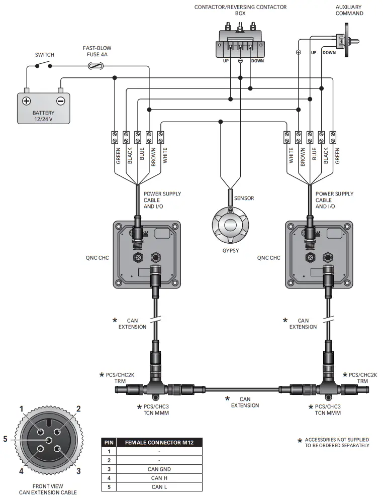

# CHC1203-canbus
Code and documentation about reverse engineering Quick's CHC1203 chain counter. The CHC1203 has two connectors at the back. One is for power,button up. button down and the sensor. This is NOT the one that talks canbus. There is a second connector that talks canbus.

## Canbus Connector pinout



Pin 3: Blue : GND
Pin 4: Grey : CAN H
Pin 5: Black: CAN L


## Canbus settings
The CHC1203 has a built-in canbus 120Ohm terminator. So it needs to be at the start or end of bus. The canbus network speed is 62000Kbps. I have had reasonable success with the following canbus bit timing. 

|Setting          |Value|
|--------------------|------|
|Clock frequency     |7.2MHz|
|SJW                 | 1|
|Baud rate           |62|
|Baud rate pre scaler|72|
|TBS1                |12|
|TBS2                | 1|


## Protocol

When the CHC1203 boots up alone on the network, it immediatly starts broadcasting its state. With my unit I get:

```
can0  6C0   [8]  C1 18 78 00 01 00 01 00 
can0  6C1   [8]  C1 18 6B 00 00 00 02 00 
can0  6C2   [8]  C1 18 00 00 00 00 00 00 
can0  6C3   [8]  C1 18 00 00 00 00 00 00 
```

## Master-Slave

If I connect a slave unit such as a CHC1102M I get some traffic. I think it ensures there is only one master on the canbus, but also any settings changed on the slave get propagated to the master.

## TODO

- The venus os sometimes configure the can interface. To do so, it has to bring the interface down. This program should recover from that. ACtually, the program should just exit and the venus watchdog will restart it.
